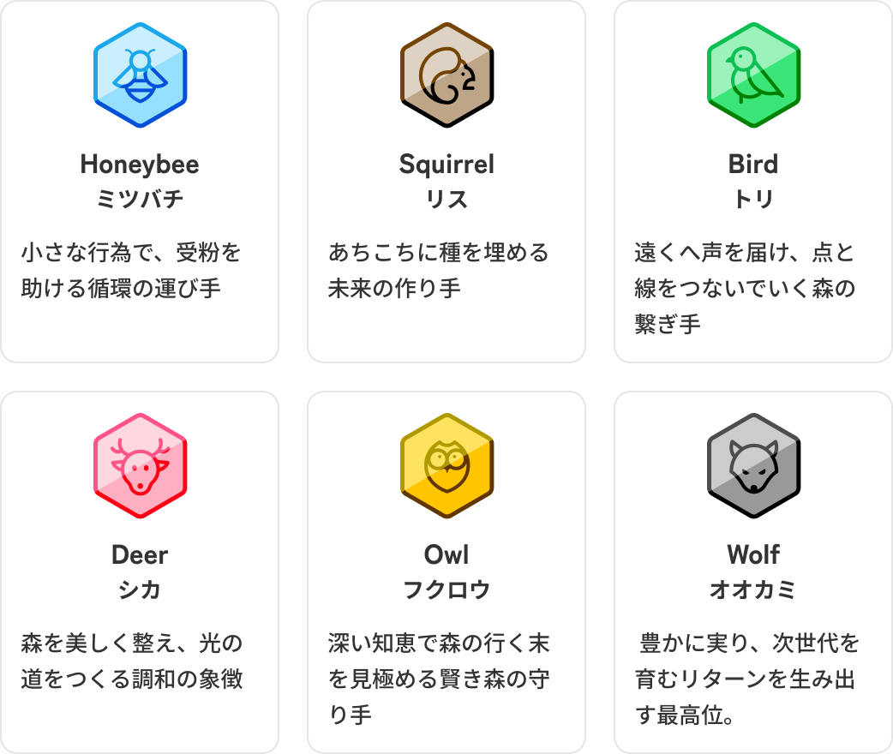

# 3.2 【Incentive】持続可能なケア活動を支える交換スコア

<figure><figcaption></figcaption></figure>

これまで、森林や里山の手入れ（間伐、下草刈り、道づくり）やコミュニティの維持運営は、ボランティア精神や地域住民の奉仕活動に依存してきました。自然資源の価値が低下した現代の市場環境では、これらの活動の動機は「環境への貢献」「社会的交流」「学び」といった内発的要因に寄りがちです。しかし、人口減少と高齢化が進む中で、このモデルは限界を迎えています。物理的・時間的負担が重く、かつ「ケア労働」に対する適切な社会的評価や報酬がない場合、活動の継続は難しく、活動がバーンアウト（燃え尽き症候群）する例も珍しくありません。また、人に憩いの機会を与える自然環境を維持するために、維持の担い手自身のウェルビーイングが損なわれる、という逆説的な状況も存在します。

FoRは、この課題に対して、FoRそのもののインセンティブとしての価値に加えて、「利用頻度に基づくステータス上昇と減価」というゲーミフィケーションを通じた循環促進メカニズムを備えています。

* **ステータス（交換スコア）の導入：** ユーザーがFoRを交換（送金・決済）するたびにステータスが上昇します。交換頻度が多く、高ステータスを維持するユーザーには、コミュニティから具体的なインセンティブ（例えば、限定イベント参加権、投票力の向上など）を与えることが可能です。
*   **時間経過による減衰：** 通貨の退蔵(貯め込み)を防ぎ、流通を促す古典的な手法として、シルビオ・ゲゼルが提唱した「デムラージュ(保有減価)」が知られています。これは、通貨を保有しているだけで時間とともにその価値が目減りするしくみであり、保有にコストを課すことで「早く使ったほうが得だ」という圧力を生み、貨幣の流通速度を強制的に高めようとするものです。

    FoRもまた、退蔵ではなく循環を望みます。お金が一箇所に滞留するのではなく、ケアからケアへと巡り続けることこそ、私たちの目指す姿だからです。しかし、森の再生のように、成果が現れるまでに長い時間を要する営みでは、資金を一定期間プールしておくことが、しばしば必要になります。ここで保有そのものにペナルティを課せば、腰を据えた長期のケアを志す人ほど不利になる可能性があります。そこで、FoRでは一部でムラージュの発想を取り入れることにしました。ユーザーの保有する通貨の価値が減るのではなく、最終交換時刻からの時間の経過に従ってステータスのみが減少していきます。減価という鞭ではなく、つながりという誘いによって、お金は巡るべきだと私たちは考えます。

この仕組みが、より積極的にFoRを交換し、流通の活性化に貢献したユーザーに対するインセンティブとなります。FoRを「価値の保存手段」として貯め込むよりも、森や地域のために「使う（循環させる）」ことが合理的かつ有利になるよう設計されており、法定通貨とは異なったかたちで、現場のケア活動への継続的な参加とモチベーション維持の機会を提供します。
