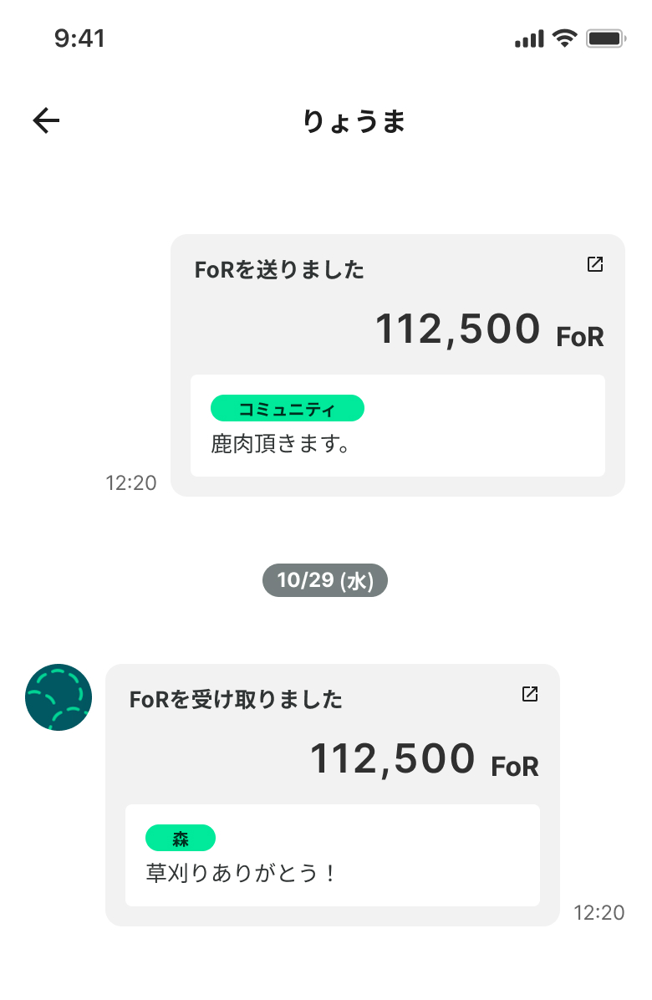

# 3.3 【Communication】繋がりを生み出すメディア

<figure><figcaption></figcaption></figure>

各地で山林改善や緑地運営に取り組む団体・組織は、それぞれ工夫を重ねつつも「点」として孤立しがちです。それぞれが同様の理念やゴールを持ちつつも、他地域・他組織との交流が少なく、知識や経験を共有・発展させる機会を持ちづらいことが課題のひとつとなっています。また、活動そのものが都市部の消費者に届きにくいという分断も存在します。消費者は「家具」や「飲料水」といった最終生産物に触れる一方で、その背後にある「誰が、どの森で、どのような想いでケアを行っているのか」という文脈を知る術を持ちません。この情報の非対称性が、森林同士、都市と自然、消費と生産の距離を広げ、関係性を希薄にしています。

FoRの決済は単なる価値の移転ではありません。人間の物理的・社会的な行動変容を促すメディアとしても機能します。そのためにFoRには以下の特徴を持たせています。

* **関係性の証明（Proof of Relationship）：** ユーザーがFoRで交換を行う際、「どのようなケア活動で使ったか」「どのような自然資源を交換したか」という物語をブロックチェーン上に記録（メタデータのハッシュのみ）することができます。
* **トランザクショナル・コミュニティの形成：** 行為や経験の履歴が可視化されることで、決済が単なる情報から「行為や経験を促すメディア」となり、孤立していた活動同士や、都市と自然を繋ぐ金銭授受を超えた関係性を構築します。

***

FoRは、以上3つの特徴を組み合わせることで、自然再生における構造的な課題を乗り越える包括的なエコシステムを構築します。自動的な資金還流（Finance）は、ケアを現場で担うローカルな活動者への直接的な支援となります。また、ゲーミフィケーションによる循環の促進（Incentive）と、物語を伴うトランザクショナル・コミュニティの形成（Communication）は、単なる経済的報酬にとどまらない「社会的承認」と「持続的なモチベーション」を生み出します。

FoRは、このケアする人がケアされる好循環の仕組みによって、従来の市場経済では過小評価されてきた自然の価値を社会に顕在化させ、適切な場所に適切な資金と人の想いが届く新たなパイプラインの構築を目指します。
