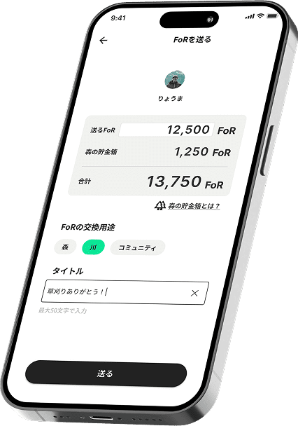

# 4.1 日常に溶け込むインターフェース

FoRが目指すのは、自然環境に関わるすべての人々を繋ぐメディアとしての通貨となることです。自然の保全活動や改善活動の現場で活躍する誰もが直感的に操作できるよう、利便性に優れたユーザーインターフェースを設計しています。多様な用途にフィットし、日常に自然と溶け込むアプリケーションとして、以下の4つの機能を提供します。

#### 01. Wallet & Exchange｜手から手へ、想いを届ける

<figure><figcaption></figcaption></figure>

自分のウォレットで、FoRを簡単に交換・送金できます。個人間の送金やお店での支払いも、直感的な操作でスムーズに完了します。日々の感謝を伝えたり、里山のナリワイ（生業）を応援したりと、それぞれのウォレットから簡単にFoRの循環をはじめることができます。

#### 02. Collective Wallet｜みんなで育てる「森の再生基金」

<figure><figcaption></figcaption></figure>

「森の再生基金」の総額を、いつでもリアルタイムに確認できます。アプリ利用者全員の決済によって積み立てられたFoRの総額を可視化することで、自分ひとりの力だけでなく、コミュニティ全体の意志が大きな「再生の原資」へと育っていく実感を共有することが可能です。

#### 03. Status & Badges｜貢献を「証明」に変える

<figure><figcaption></figcaption></figure>

どれだけ自然をケアし、循環に貢献したか（交換頻度や履歴）に応じて、ユーザーにはステータスとバッジが付与されます。楽しみながら使い続ける仕組みが、そのまま「リジェネラティブな暮らし」への参加の表明となるようなビジュアライズを行っています。

#### 04. Timeline & Story｜記録が紡ぐ、再生の物語

<figure><figcaption></figcaption></figure>

「いつ、何に使ったか」というブロックチェーン上に刻まれた透明性の高い履歴を残すことができます。それは単なる決済データにとどまりません。それはそのまま、あなたが「どう自然を支えたか」というケアの物語を伝える記録となり、通貨の交換を豊かなストーリーへと昇華させます。
